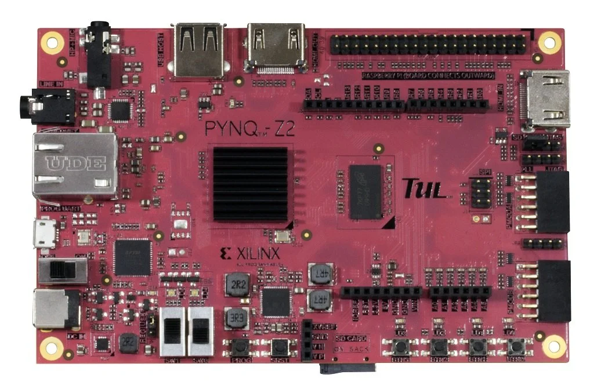
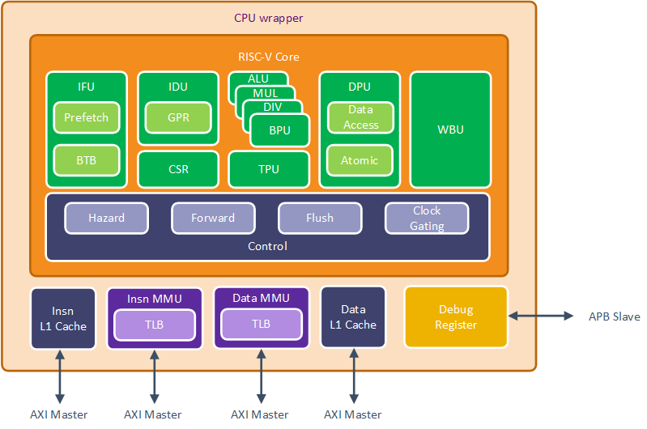
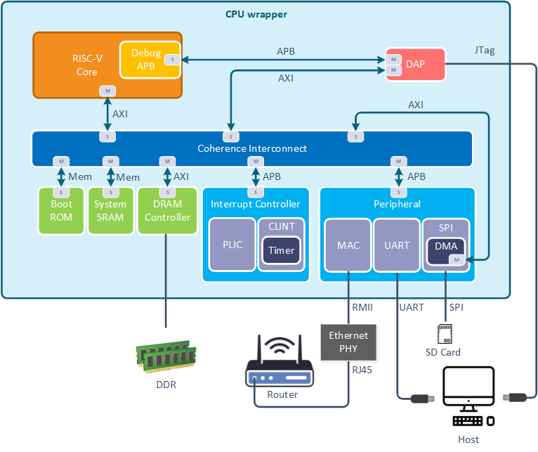
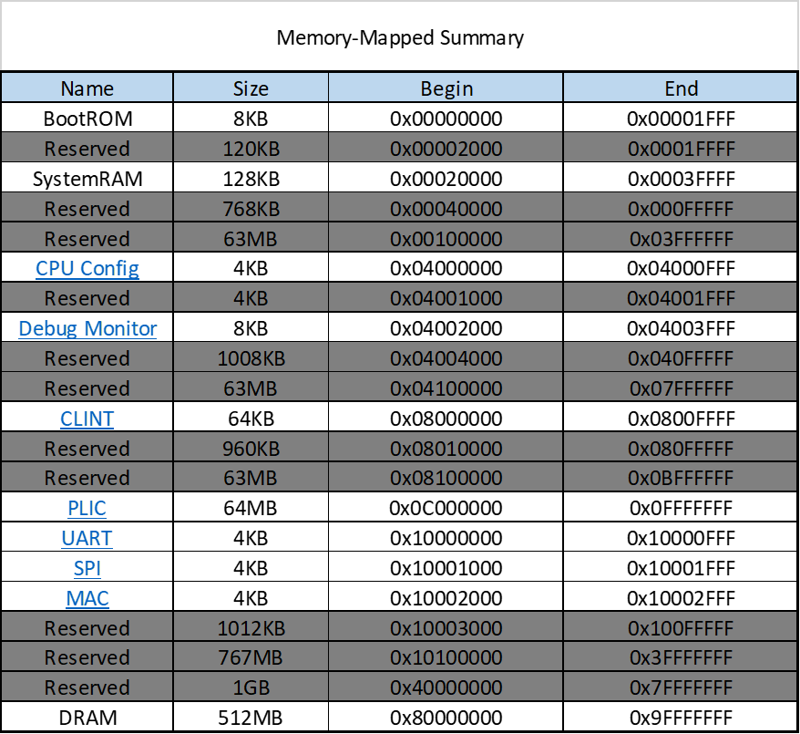
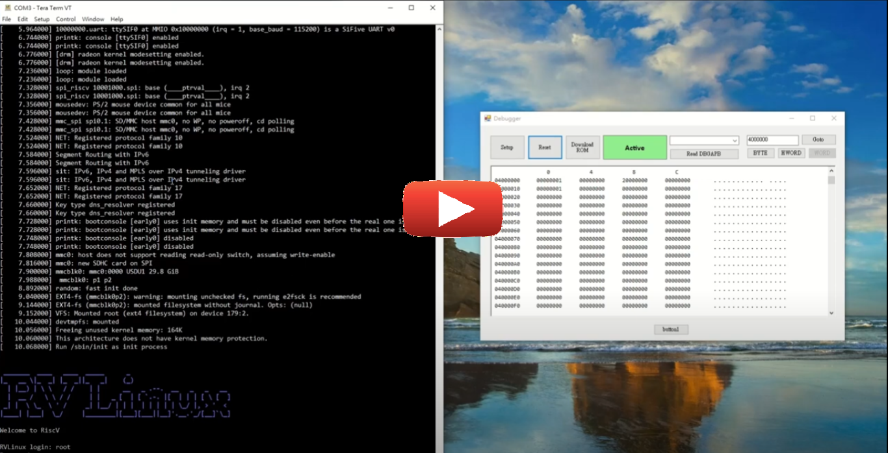
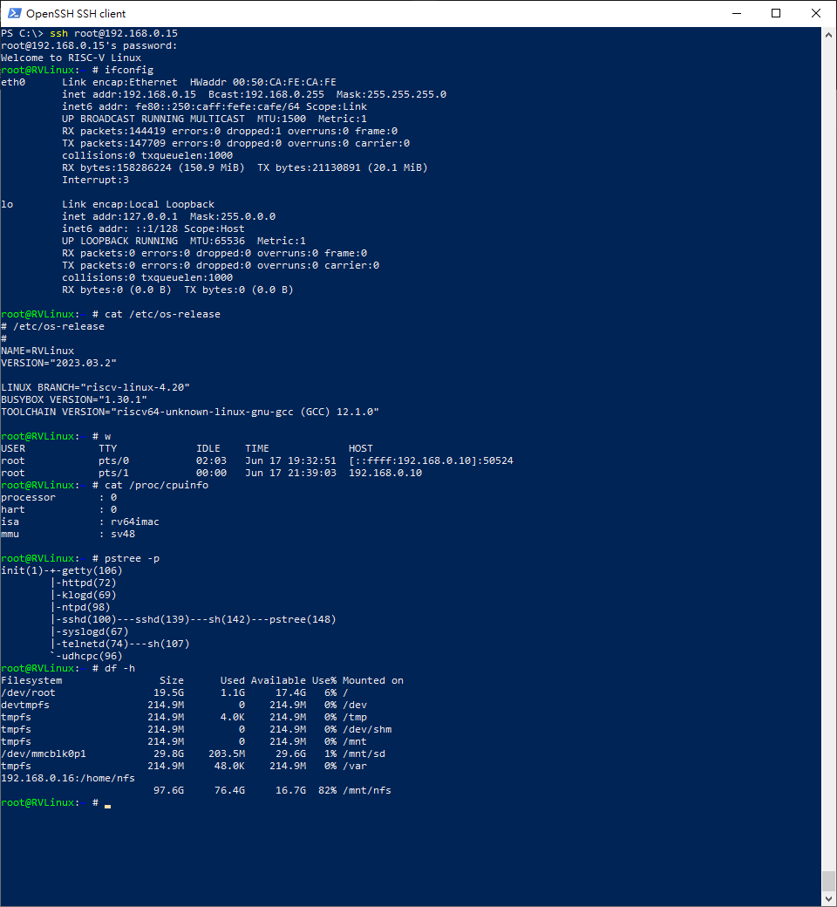

# RISC-V SoC
This repository contains the full RISC-V SoC RTL include RISC-V CPU, coherence bus, BootROM, system SRAM, interrupt controller, ethernet MAC, SPI, UART and Debug Access Port(DAP). Also provide basic ROM code that CPU can load boot loader and OS from SD card via SPI.

## Environment
- PYNQ-z2
  

## CPU block diagram
  

## SoC block diagram
  

## Memory mapping
  

## Demonstration
- Boot up linux 4.20
  

- Connect RISC-V SoC via SSH
  

## MISC
- Watch for more detail [here](https://hackmd.io/@w4K9apQGS8-NFtsnFXutfg/B1Re5uGa5)

## Authors
[Yu-Tong Shen](https://github.com/yutongshen/)

###### tags: `RISC-V`
